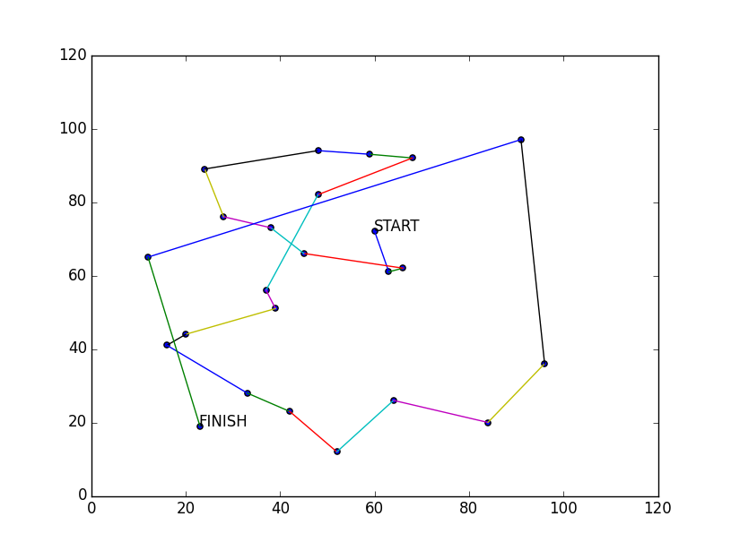
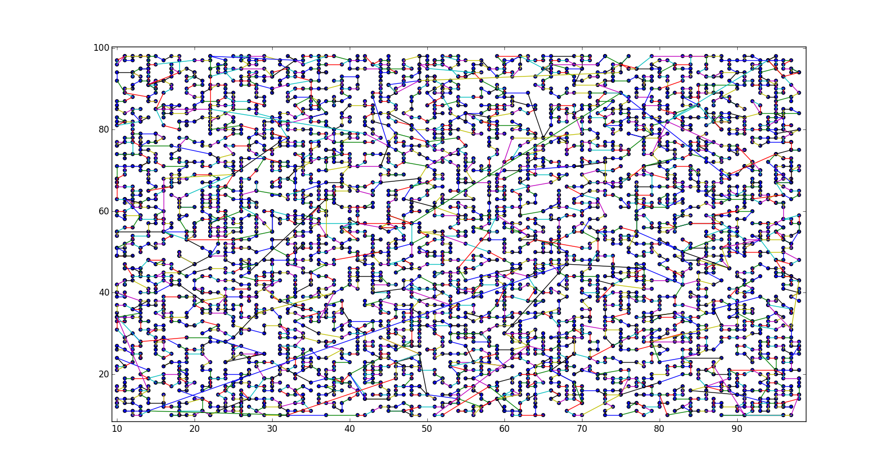

## Алгоритм ближайшего соседа для задачи коммивояжёра

Описание алгоритма: [Википедия](https://ru.wikipedia.org/wiki/Алгоритм_ближайшего_соседа_в_задаче_коммивояжёра)

Пример работы: [example.py](example.py)

## Зависимости:
* Python 3.4
* Matplotlib

Описание изображения | Изображение
---|:---:
Пример работы | 
5000 точек | 
Процесс "прокладывания" пути | 
